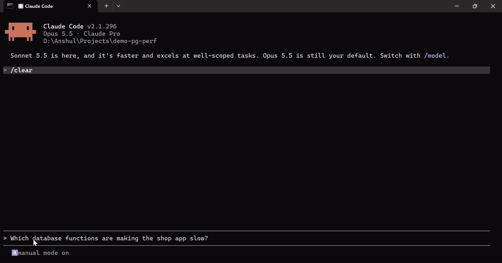
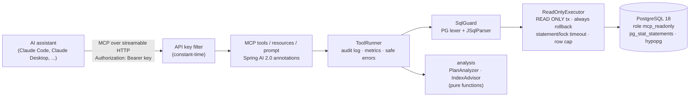

# pg-perf-mcp

[](https://github.com/gouranshul/pg-perf-mcp/actions/workflows/ci.yml)
[](LICENSE)


**An MCP server that lets AI assistants diagnose PostgreSQL performance problems safely**: slow
queries, EXPLAIN plans, index suggestions, table health and lock contention. It is read-only by
design.

## Why

When a page is slow, developers paste a query into a chat and ask "why is this slow?". The
assistant then guesses, because it cannot see the plan, the table sizes, the existing indexes or
which queries actually dominate the load.

pg-perf-mcp gives the assistant **real numbers from `pg_stat_statements`, `EXPLAIN` and the
catalogs**, through a narrow, audited, read-only interface. It cannot change data, cannot run DDL,
and never creates the indexes it recommends.

## Demo



`demo/tour.sh` makes the same MCP calls an assistant would, against the demo stack with real
numbers: the slowest statement, its plan, an index suggestion costed with hypopg, and a write
attempt that the SQL guard rejects. (Recorded with [VHS](https://github.com/charmbracelet/vhs)
from [docs/demo.tape](docs/demo.tape).)

A condensed, illustrative session against the demo shop (`docker compose up`, then
`./demo/workload.sh`). Exact numbers vary from run to run:

```text
You:    The shop database feels slow. What's going on?

Claude: [top_slow_queries orderBy=total_time]
        The top statement by total time is
          SELECT id, status, total, created_at FROM shop.orders WHERE customer_id = $1 ORDER BY created_at DESC
        (thousands of calls, the largest share of total execution time).

        [explain_query sql="... WHERE customer_id = 42 ORDER BY created_at DESC"]
        HIGH  SEQ_SCAN_ON_LARGE_TABLE  Seq Scan on shop.orders
              reads all ~1.0M rows of shop.orders to apply filter (customer_id = 42); only a handful match.

        [suggest_indexes]
        CREATE INDEX CONCURRENTLY idx_orders_customer_id ON shop.orders (customer_id);
        hypopg: the planner would use it; estimated cost drops by well over 90%.
        Not executed. Review it and run it yourself, ideally off-peak.

        [table_health table=shop.orders]
        Autovacuum is disabled on shop.orders and ~20% of rows are dead. Re-enable autovacuum and VACUUM.

        Prioritized actions: 1) add the index above (orders.customer_id is a foreign key with no index),
        2) re-enable autovacuum on shop.orders, 3) ...
```

## Architecture



## Tools

| Tool | What it does | Safety notes |
|------|--------------|--------------|
| `top_slow_queries` | Most expensive statements from `pg_stat_statements`: normalized text, calls, total/mean/max ms, rows, cache hit ratio, share of total time. Order by `total_time`, `mean_time`, `calls` or `rows`. | Fixed SQL; sort column chosen from an enum. Excludes the server's own statements. |
| `explain_query` | Summarized plan: 5 costliest nodes, seq scans on large tables, 10x row misestimates, disk sorts/hash spills, nested loops with many iterations. `analyze=true` adds real timings. `$1` placeholders get a generic plan. | SQL guard first. ANALYZE runs in a read-only transaction that is rolled back and cancelled after the timeout. |
| `suggest_indexes` | `CREATE INDEX CONCURRENTLY` candidates from filtered seq scans, join keys and `ORDER BY ... LIMIT`, each with a reason; validated with hypothetical indexes when `hypopg` is installed. | **Never executed.** Hypothetical indexes are reset in a savepoint so they cannot leak to other calls. |
| `unused_indexes` | Indexes with `idx_scan = 0`, largest first, excluding primary key, unique and constraint indexes; includes size, definition and a `DROP INDEX CONCURRENTLY` to review. | Nothing is dropped. Reports when stats were last reset. |
| `table_health` | Live/dead tuples, dead ratio, last (auto)vacuum/analyze, rows changed since analyze, seq vs index scans, sizes, with plain-language warnings. | Catalog reads only. |
| `blocking_sessions` | Blocked/blocking pairs via `pg_blocking_pids`, truncated query texts, wait time, lock type/mode/table, blocker state, root blockers. | Never cancels or terminates anything. |
| `slow_functions` | User-defined functions (PL/pgSQL, SQL, ...) ranked by total, self or mean time or calls, from `pg_stat_user_functions`, with language and volatility. | Catalog reads only. Needs `track_functions`. |
| `explain_function` | Looks **inside** the functions a query calls: time per function, every statement executed inside them with calls, time and its own analyzed plan, and findings such as a seq scan inside a function, a function called once per row, or a read-only function left `VOLATILE`. Includes the function source. | SQL guard first; runs in the same rolled-back read-only transaction as `explain_query`, so functions that write fail. `auto_explain` is switched on for that transaction only, with generic plans so no data values appear. |

**Resources:** `pg://schema/overview` (tables, row estimates, sizes, indexes) and
`pg://schema/{table}` (columns, indexes with scan counts, foreign keys flagged when unindexed).
**Prompt:** `diagnose_slow_database`, a guided workflow: slow queries, then explain, suggest
indexes, table health, functions, then a prioritized summary.

### Why a separate tool for database functions

`EXPLAIN` shows a function call as one opaque expression, and charges its time to whichever plan
node evaluates it. On the demo catalog page (20 products, each calling `shop.product_rating`),
`explain_query` blames the index scan on `products` (184 ms self time) and finds nothing else
serious. `explain_function` on the same query, against the full demo data:

```text
shop.product_rating          plpgsql  20 calls  99% of execution time
  SELECT avg(rating) FROM shop.reviews WHERE product_id = p_product_id
                             20 calls  175 ms  96% of execution time
HIGH    FUNCTION_DOMINATES_QUERY  shop.product_rating takes 99% of the query's execution time
HIGH    FUNCTION_CALLED_PER_ROW   ran 20 times for one query (9.0 ms per call)
HIGH    SEQ_SCAN_ON_LARGE_TABLE   inside shop.product_rating: Seq Scan on shop.reviews
                                  reads all ~250k rows to apply filter (reviews.product_id = $1)
```

How it works ([ADR 0006](docs/adr/0006-looking-inside-database-functions.md)): the query runs once
with `auto_explain` enabled for that transaction only, so the plan of each nested statement comes
back as a notice; per-function time comes from `pg_stat_xact_user_functions` and per-statement
calls from `pg_stat_statements`, both as before/after differences.

## Security model

Five independent layers stand between the assistant and a write (details in
[ADR 0001](docs/adr/0001-read-only-defense-in-depth.md)):

1. **SQL guard:** exactly one plain `SELECT`. It is checked by a PostgreSQL-faithful lexer *and*
   JSqlParser, and both must agree. Blocks DML/DDL, multiple statements, data-modifying CTEs,
   `SELECT INTO`, `FOR UPDATE/SHARE`, `COPY`, `DO`, and dangerous functions (`pg_sleep*`, `*_file`,
   `lo_*`, `dblink*`, `set_config`, `pg_terminate_backend`, `query_to_xml`, ...). It fails closed.
2. **Read-only role:** `mcp_readonly` has `SELECT` plus `pg_read_all_stats`/`pg_monitor`, with
   `default_transaction_read_only = on` and `statement_timeout = 5s` set on the role.
3. **Read-only connections:** Hikari `readOnly=true` and a read-only session default.
4. **One rolled-back read-only transaction per call:** `statement_timeout`/`lock_timeout` set
   locally, `standard_conforming_strings` forced on, always rolled back.
5. **Row cap:** every result is capped (default 200 rows).

Around those layers: a bearer API key (constant-time comparison; only `/actuator/health` is
open), a JSON audit line per call (SQL stored as a SHA-256 hash plus an 80-character preview),
error messages with no stack traces or connection details, and metrics `mcp.tool.duration` and
`mcp.guard.rejections`.

## Quickstart

Requirements: Docker. (To build and test from source you also need Java 25.)

```bash
cp .env.example .env        # then replace the placeholder secrets
docker compose up --build   # Postgres 18 + seeded demo shop (~4.5M rows) + the MCP server on :8080
```

Generate some slow-query statistics (optional, but makes `top_slow_queries` interesting):

```bash
./demo/workload.sh          # 60s of deliberately bad queries via pgbench
./demo/lock-scenario.sh     # holds a row lock for 2 minutes so blocking_sessions has something to show
./demo/smoke-test.sh        # curl-based end-to-end check of health, auth and two tool calls
./demo/tour.sh              # the narrated walkthrough from the GIF above (needs curl and jq)
```

### Connect from Claude Code

```bash
claude mcp add --transport http pg-perf http://localhost:8080/mcp --header "Authorization: Bearer $MCP_API_KEY"
```

Then ask: *"Use pg-perf to find out why the shop database is slow"*, or run the
`diagnose_slow_database` prompt.

### Connect from Claude Desktop

Claude Desktop launches stdio servers, so use the `mcp-remote` bridge
(`claude_desktop_config.json`):

```json
{
  "mcpServers": {
    "pg-perf": {
      "command": "npx",
      "args": ["-y", "mcp-remote", "http://localhost:8080/mcp", "--header", "Authorization:${AUTH_HEADER}"],
      "env": { "AUTH_HEADER": "Bearer <your MCP_API_KEY>" }
    }
  }
}
```

### Point it at your own database

Create a role like `mcp_readonly` (see [`docker/init.sql`](docker/init.sql)), make sure
`pg_stat_statements` is in `shared_preload_libraries`, and set the variables below. Prefer a
replica or staging database: `analyze=true` and `explain_function` execute queries.

For the function tools (optional; everything else works without them):

```sql
-- postgresql.conf: track_functions = 'pl' (or 'all' to include SQL functions), then reload.
-- Load auto_explain for this role only (no restart needed); it stays inactive until a call enables it:
ALTER ROLE mcp_readonly SET session_preload_libraries = 'auto_explain';
-- PostgreSQL 15+: let the role change only these settings, only for its own transactions:
GRANT SET ON PARAMETER auto_explain.log_min_duration, auto_explain.log_analyze,
    auto_explain.log_nested_statements, auto_explain.log_format, auto_explain.log_level,
    auto_explain.log_verbose, auto_explain.log_parameter_max_length TO mcp_readonly;
```

Without these, `explain_function` still reports what it can and says in `notes` what is missing.

## Configuration

| Variable / property | Default | Purpose |
|---------------------|---------|---------|
| `MCP_API_KEY` | _(required)_ | Bearer token clients must send; at least 16 characters. The server will not start without it. |
| `PGPERF_DB_URL` | `jdbc:postgresql://localhost:5432/shop` | JDBC URL |
| `PGPERF_DB_USER` / `PGPERF_DB_PASSWORD` | `mcp_readonly` / _(empty)_ | Database credentials (use a read-only role) |
| `pgperf.query.statement-timeout` | `5s` | Per-call `statement_timeout` and `lock_timeout` |
| `pgperf.query.max-rows` | `200` | Row cap for every query |
| `pgperf.guard.max-sql-length` | `20000` | Longest SQL accepted |
| `pgperf.functions.nested-plan-threshold` | `1ms` | `explain_function` keeps the plan of a statement inside a function only for executions at least this long (every execution is still counted) |
| `OTEL_TRACING_ENABLED` | `false` | Export traces via OTLP/HTTP |
| `OTEL_EXPORTER_OTLP_ENDPOINT` | `http://localhost:4318/v1/traces` | OTLP traces endpoint |
| `OTEL_TRACING_SAMPLING_PROBABILITY` | `1.0` | Trace sampling ratio |

Properties can also be set as environment variables (`PGPERF_QUERY_STATEMENT_TIMEOUT=3s`, ...).
Metrics are at `/actuator/prometheus` (requires the API key).

## Build and test

```bash
./mvnw verify
```

This runs unit tests, Testcontainers integration tests against PostgreSQL 18 (same image, init
scripts and read-only role as compose; needs Docker), an end-to-end test with the MCP Java SDK
client over HTTP, and a JaCoCo gate (80% lines on the `guard` and `analysis` packages).

## Design decisions

- [0001: Read-only by design, enforced in depth](docs/adr/0001-read-only-defense-in-depth.md)
- [0002: Streamable HTTP transport](docs/adr/0002-streamable-http-transport.md)
- [0003: Summarized plans instead of raw EXPLAIN](docs/adr/0003-summarized-plans-instead-of-raw-explain.md)
- [0004: Suggest indexes, never execute them](docs/adr/0004-suggest-never-execute-indexes.md)
- [0005: Platform versions and API differences](docs/adr/0005-platform-versions-and-api-notes.md)
- [0006: Looking inside database functions](docs/adr/0006-looking-inside-database-functions.md)

## Roadmap

- OAuth 2.1 resource server per the MCP authorization spec (per-user identity instead of a shared key)
- Multiple named database targets, with read replicas preferred
- Workload-level index advice (weigh candidates across all top queries, not one at a time)
- `auto_explain` log / `pg_stat_kcache` ingestion for plans of queries that already ran in production
- Optional raw-plan output and per-tool rate limits
- MCP elicitation to confirm `analyze=true` on expensive queries

## License

[MIT](LICENSE) © 2026 Anshul Gour
